# Artemis Agent

> **Artemis — Local AI SRE / DevOps Copilot**

Artemis is a **local-first Agentic AI project** designed to explore how AI agents can assist with Kubernetes and DevOps/SRE operations.

The project is being built incrementally using open-source and locally running technologies, with a focus on learning:

- Large Language Models (LLMs)
- Agentic AI
- Tool calling
- Kubernetes automation
- Retrieval-Augmented Generation (RAG)
- Model Context Protocol (MCP)
- Multi-agent systems
- Agent observability
- Safe AI-assisted remediation

The long-term goal is to build an AI SRE assistant capable of investigating Kubernetes incidents, consulting runbooks, identifying probable root causes, and recommending remediation actions.

---

## Project Status

| Component / Phase | Status |
|---|---|
| Local development environment | ✅ Completed |
| Ollama | ✅ Completed |
| Qwen3 local model | ✅ Completed |
| Google ADK | ✅ Completed |
| Minikube Kubernetes cluster | ✅ Completed |
| Podman | ✅ Completed |
| ADK Web UI | ✅ Completed |
| Kubernetes `get_pods()` tool | ✅ Completed |
| Single-agent Kubernetes inspection | ✅ Completed |
| Pod logs investigation | ⏳ Next |
| Kubernetes events investigation | ⏳ Next |
| Failure diagnosis / RCA | ⏳ Planned |
| RAG / Runbooks | ⏳ Planned |
| MCP | ⏳ Planned |
| Multi-agent architecture | ⏳ Planned |
| Safe remediation with approval | ⏳ Planned |
| Langfuse observability | ⏳ Planned |
| GCP / GKE integration | ⏳ Future |
| Terraform / CI/CD integration | ⏳ Future |

---

# 1. Project Vision

The ultimate vision is:

```text
User
  |
  v
Artemis AI SRE
  |
  +-------------------+
  |                   |
  v                   v
Kubernetes          Knowledge
Tools               Base / RAG
  |                   |
  v                   v
Minikube          Runbooks / Docs
  |
  v
Incident Analysis
  |
  v
Root Cause Analysis
  |
  v
Recommended Remediation
  |
  v
Human Approval
  |
  v
Safe Remediation
```

For example, a user should eventually be able to ask:

> Why is my checkout-service pod failing?

Artemis should be able to:

1. Inspect Kubernetes pods.
2. Identify the unhealthy pod.
3. Retrieve pod logs.
4. Retrieve Kubernetes events.
5. Search relevant troubleshooting runbooks.
6. Correlate the evidence.
7. Explain the probable root cause.
8. Recommend remediation.
9. Ask for human approval before making any change.

---

# 2. Technology Stack

| Technology | Purpose |
|---|---|
| Python | Agent and tool development |
| Google ADK | Agent development and orchestration |
| Ollama | Local LLM runtime |
| Qwen3 0.6B | Local LLM |
| Podman | Container runtime |
| Minikube | Local Kubernetes cluster |
| kubectl | Kubernetes CLI |
| ChromaDB | Planned local vector database |
| MCP | Planned standard tool integration |
| Langfuse | Planned observability |
| GitHub | Source control |
| Terraform | Planned infrastructure automation |
| GCP / GKE | Planned cloud integration |

The current Qwen3 0.6B model is intentionally being used because the project is designed to run locally with low resource consumption. Ollama currently lists the model at approximately 523 MB.

---

# 3. Local Architecture — Current

The current architecture is intentionally simple.

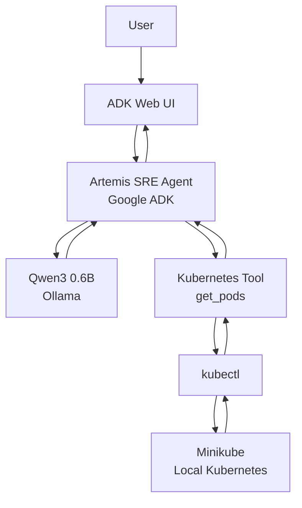

The important concept is:

```text
User
  ↓
Agent
  ↓
LLM decides what to do
  ↓
Tool
  ↓
kubectl
  ↓
Kubernetes
  ↓
Tool result
  ↓
LLM
  ↓
Human-readable response
```

---

# 4. Current Project Structure

The project currently follows this general structure:

```text
artemis_agent/
│
├── app/
│   ├── __init__.py
│   ├── agent.py
│   │
│   └── tools/
│       ├── __init__.py
│       └── kubernetes.py
│
├── knowledge/
│   ├── kubernetes/
│   ├── troubleshooting/
│   ├── runbooks/
│   └── sre/
│
├── tests/
│
├── pyvenv/
│
└── README.md
```

Some directories such as `knowledge/` and `tests/` are part of the planned project structure and will be expanded as the project progresses.

---

# 5. Environment Setup

## Prerequisites

The project is designed to run locally on macOS.

Current development environment:

```text
MacBook Pro
Apple M4 Pro
48 GB RAM
512 GB SSD
```

Docker Desktop is not required.

Podman is used instead.

---

# 6. Install Required Components

## 6.1 Podman

Install Podman and verify:

```bash
podman --version
```

Start the Podman machine if required:

```bash
podman machine start
```

Verify:

```bash
podman info
```

---

## 6.2 kubectl

Verify:

```bash
kubectl version --client
```

---

## 6.3 Minikube

Verify:

```bash
minikube version
```

Start the cluster:

```bash
minikube start
```

Verify:

```bash
kubectl get nodes
```

Expected:

```text
NAME       STATUS   ROLES           AGE
minikube   Ready    control-plane   ...
```

---

## 6.4 Ollama

Verify:

```bash
ollama --version
```

Check installed models:

```bash
ollama list
```

---

# 7. Qwen3 Local Model

Artemis currently uses:

```text
qwen3:0.6b
```

Pull the model:

```bash
ollama pull qwen3:0.6b
```

Run it directly:

```bash
ollama run qwen3:0.6b
```

The current Artemis configuration uses:

```python
model="ollama/qwen3:0.6b"
```

Qwen3 is suitable for this project because the Qwen3 family supports tool integration, including external tools.

> **Note:** The 0.6B model is being used primarily for local development and learning. As the agent becomes more complex, larger models can be evaluated if stronger reasoning or tool-selection quality is required.

---

# 8. Google ADK

Google ADK is the primary agent framework for Artemis.

The basic concept is:

```text
Agent
 ├── Model
 ├── Instructions
 └── Tools
```

ADK tools can be implemented as Python functions and registered with the agent.

The current Artemis agent looks conceptually like:

```python
from google.adk.agents import Agent

from .tools.kubernetes import get_pods


root_agent = Agent(
    name="artemis_sre_agent",

    model="ollama/qwen3:0.6b",

    description="A local AI SRE assistant for Kubernetes and DevOps.",

    instruction="""
    You are Artemis, an AI SRE assistant.

    You help users troubleshoot Kubernetes and DevOps problems.

    You have access to Kubernetes tools that allow you
    to inspect the cluster.

    Use the Kubernetes tools when the user asks about
    the actual state of the Kubernetes cluster.

    Do not make any changes to infrastructure.
    All Kubernetes operations are read-only.
    """,

    tools=[
        get_pods,
    ],
)
```

---

# 9. Running Artemis

From the project directory:

```bash
adk web app
```

The ADK development UI can then be opened in the browser.

The development workflow is:

```text
Edit Agent / Tool
       ↓
Start ADK Web
       ↓
Ask Question
       ↓
Agent Reasoning
       ↓
Tool Call
       ↓
Kubernetes
       ↓
Tool Result
       ↓
Agent Response
```

---

# 10. Phase 1 — Kubernetes SRE Agent

## Status: ✅ Completed

The first milestone was to create a single AI agent capable of inspecting the Kubernetes cluster.

The first tool implemented is:

```text
get_pods()
```

It executes:

```bash
kubectl get pods -A
```

The tool is read-only.

Current implementation:

```python
import subprocess


def get_pods() -> str:
    """Get all pods from the current Kubernetes cluster."""

    result = subprocess.run(
        ["kubectl", "get", "pods", "-A"],
        capture_output=True,
        text=True,
        timeout=30,
    )

    if result.returncode != 0:
        return f"kubectl failed:\n{result.stderr}"

    return f"KUBERNETES PODS:\n{result.stdout}"
```

---

# 11. Phase 1 Architecture

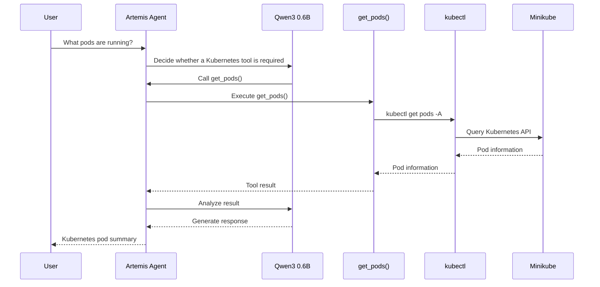

This is the first real Agentic AI loop in Artemis:

```text
Reason → Act → Observe → Reason → Respond
```

---

# 12. Phase 2 — Kubernetes Failure Investigation

## Status: ⏳ Next

The next milestone is to expand Artemis from simply **reading cluster state** to **investigating failures**.

New tools:

```text
get_pods()
get_pod_logs()
get_pod_events()
get_deployment_status()
get_service_status()
```

The first important troubleshooting question will be:

> Why is my backend pod failing?

---

# 13. Failure Investigation Flow

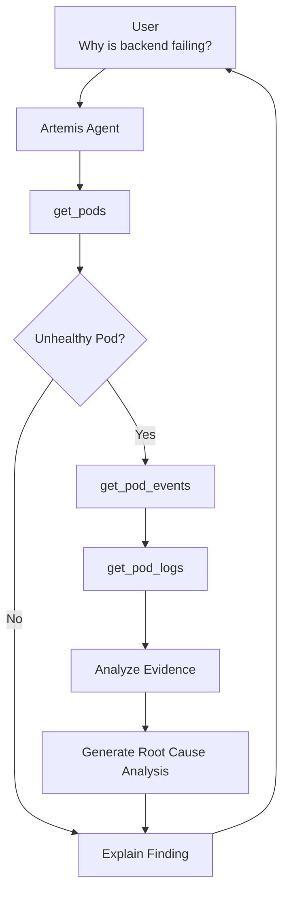

---

# 14. Intentionally Create Kubernetes Failures

To learn AI-assisted troubleshooting, Artemis will eventually run against intentionally broken workloads.

Examples:

```text
CrashLoopBackOff
ImagePullBackOff
Pending Pod
High Restart Count
Service Not Reachable
```

Example investigation:

```text
User:
Why is checkout-api failing?

        ↓

Artemis

        ↓

get_pods()

        ↓

checkout-api
CrashLoopBackOff
5 restarts

        ↓

get_pod_events()

        ↓

Container failed to start

        ↓

get_pod_logs()

        ↓

Application error

        ↓

Artemis

        ↓

Root Cause Analysis
```

---

# 15. Phase 3 — RAG / Runbook Intelligence

## Status: ⏳ Planned

Once Kubernetes investigation works, Artemis will be given access to operational knowledge.

Planned structure:

```text
knowledge/
│
├── kubernetes/
│
├── troubleshooting/
│
├── runbooks/
│   ├── crashloopbackoff.md
│   ├── imagepullbackoff.md
│   ├── pod-pending.md
│   ├── high-restarts.md
│   └── service-not-reachable.md
│
└── sre/
```

The goal is to combine:

```text
Live Kubernetes State
+
Historical / Operational Knowledge
=
Better Incident Analysis
```

---

# 16. RAG Architecture

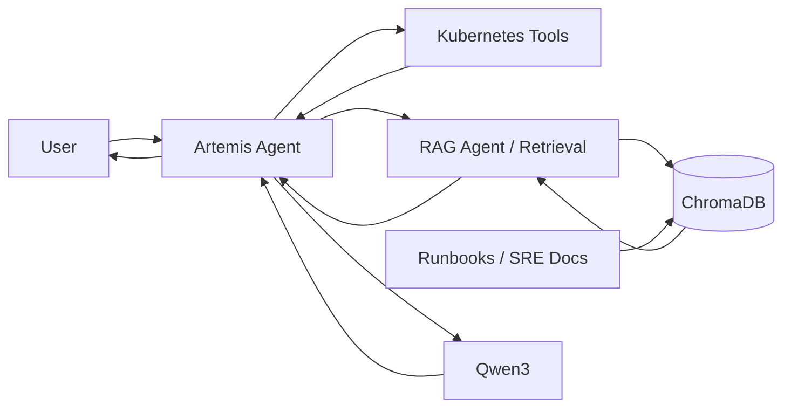

---

# 17. Phase 4 — MCP

## Status: ⏳ Planned

After native ADK tools are working correctly, MCP will be introduced.

The purpose is to learn the difference between:

### Native ADK Tool

```text
Agent
  ↓
Python Function
  ↓
kubectl
```

### MCP

```text
Agent
  ↓
MCP Client
  ↓
MCP Server
  ↓
Tool
  ↓
Kubernetes / GitHub / GCP
```

MCP will allow Artemis to interact with external systems through standardized tool interfaces.

Potential future MCP tools:

```text
Kubernetes
GitHub
GCP
Terraform
CI/CD
```

---

# 18. MCP Architecture

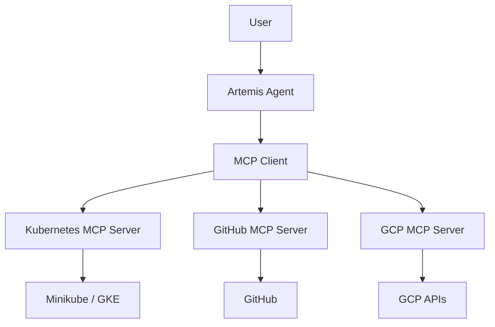

---

# 19. Phase 5 — Multi-Agent Artemis

## Status: ⏳ Planned

Once the single agent becomes capable, Artemis will evolve into a multi-agent system.

Planned agents:

```text
Supervisor Agent
│
├── Kubernetes Agent
│
├── RAG Agent
│
├── GCP Agent
│
└── RCA Agent
```

---

# 20. Multi-Agent Architecture

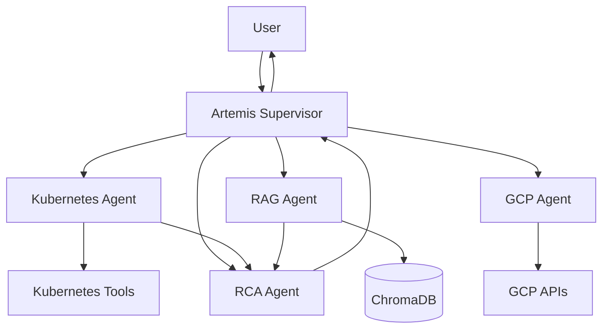

---

# 21. Example Multi-Agent Investigation

User asks:

> Why is checkout-service experiencing failures?

Artemis Supervisor:

```text
1. Delegate Kubernetes inspection
              ↓
2. Kubernetes Agent
              ↓
3. Identify unhealthy pods
              ↓
4. Collect logs/events
              ↓
5. RAG Agent searches runbooks
              ↓
6. RCA Agent correlates evidence
              ↓
7. Supervisor summarizes findings
              ↓
8. User receives RCA
```

Sequence:

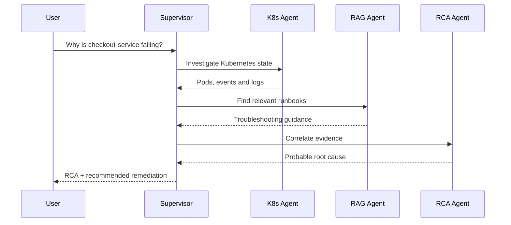

---

# 22. Phase 6 — Safe Remediation

## Status: ⏳ Planned

Artemis will initially be **read-only**.

This is intentional.

The agent should first learn to:

```text
Observe
  ↓
Investigate
  ↓
Explain
  ↓
Recommend
```

Only later should it be allowed to:

```text
Execute
```

with explicit human approval.

Example:

```text
Artemis:

checkout-api is repeatedly crashing.

Evidence:
- Pod restarted 12 times
- Application logs show configuration error
- Kubernetes events show normal scheduling

Recommendation:
Verify the application configuration.

No changes have been made.
```

For an approved operational action:

```text
Artemis:

I recommend restarting deployment checkout-api.

Approve this action?

Human:
Yes

Artemis:
Executing approved action...
```

---

# 23. Safe Remediation Architecture

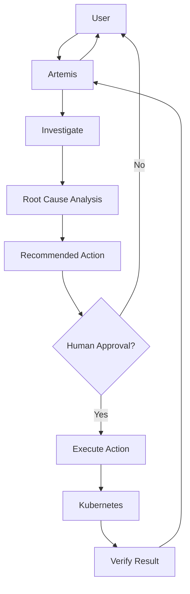

---

# 24. Phase 7 — Observability with Langfuse

## Status: ⏳ Planned

Langfuse will be introduced once the agent workflow becomes more complex.

The purpose is to observe:

- Agent calls
- LLM calls
- Tool calls
- Latency
- Token usage
- Errors
- RAG retrieval
- Agent traces
- Evaluation results

Target architecture:

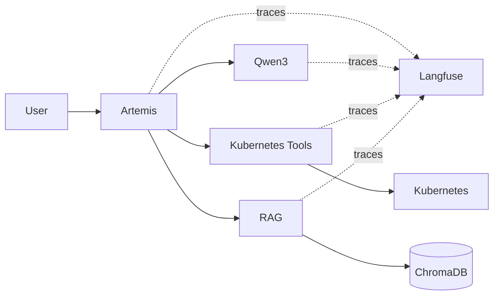

---

# 25. Final Target Architecture

The eventual Artemis architecture will combine all the major concepts learned in this project.

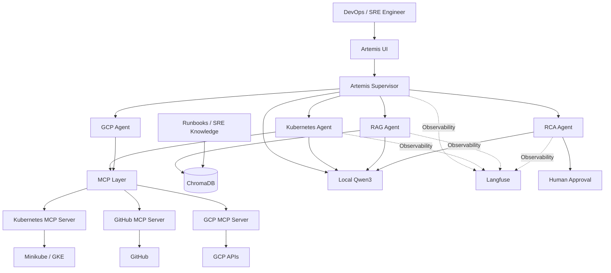

---

# 26. End-to-End Agentic Flow

The final workflow can be summarized as:

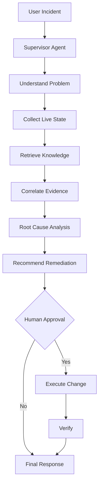

This represents the core learning objective of Artemis:

```text
LLM
 ↓
Agent
 ↓
Tool Calling
 ↓
Live Infrastructure
 ↓
RAG
 ↓
Reasoning
 ↓
Multi-Agent Collaboration
 ↓
Human Approval
 ↓
Safe Automation
 ↓
Observability
```

---

# 27. Development Roadmap

| Phase | Capability | Status |
|---|---|---|
| 0 | Local environment setup | ✅ Completed |
| 0 | Podman | ✅ Completed |
| 0 | Minikube | ✅ Completed |
| 0 | Ollama | ✅ Completed |
| 0 | Qwen3 0.6B | ✅ Completed |
| 0 | Google ADK | ✅ Completed |
| 0 | ADK Web UI | ✅ Completed |
| 1 | Single Kubernetes Agent | ✅ Completed |
| 1 | `get_pods()` | ✅ Completed |
| 2 | `get_pod_logs()` | ⏳ Next |
| 2 | `get_pod_events()` | ⏳ Next |
| 2 | Failure simulation | ⏳ Next |
| 2 | Root Cause Analysis | ⏳ Next |
| 3 | RAG | ⏳ Planned |
| 3 | ChromaDB | ⏳ Planned |
| 4 | MCP | ⏳ Planned |
| 5 | Multi-agent | ⏳ Planned |
| 6 | Human approval | ⏳ Planned |
| 7 | Langfuse | ⏳ Planned |
| 8 | GCP/GKE | ⏳ Future |
| 8 | Terraform | ⏳ Future |
| 8 | GitHub Actions | ⏳ Future |

---

# 28. Learning Objectives

By completing Artemis, the project should demonstrate practical understanding of:

### LLM

How locally hosted LLMs work and how they generate responses.

### Agent

How an LLM becomes an agent by combining:

```text
LLM + Instructions + Tools + Decision Loop
```

### Tool Calling

How an agent can decide to invoke external functions such as:

```text
get_pods()
get_pod_logs()
get_pod_events()
```

### RAG

How agents can retrieve relevant knowledge before generating an answer.

### MCP

How agents can interact with external tools and systems through a standardized protocol.

### Multi-Agent Systems

How specialized agents can collaborate on complex problems.

### Human-in-the-Loop

How potentially risky infrastructure operations can require explicit approval.

### Observability

How to trace and evaluate agent behavior.

---

# 29. Current Completed Milestone

At the current stage Artemis can be represented as:

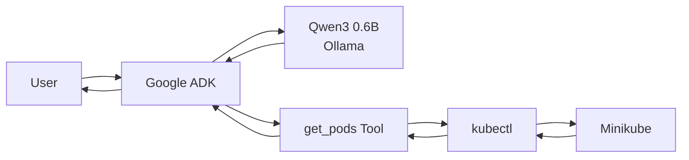

### Completed learning loop

```text
User
 ↓
Google ADK Agent
 ↓
Qwen3 0.6B
 ↓
Tool Selection
 ↓
get_pods()
 ↓
kubectl
 ↓
Minikube
 ↓
Tool Result
 ↓
Qwen3
 ↓
Response
```

---

# 30. Next Immediate Step

The next implementation milestone is:

## Add `get_pod_logs()`

Then add:

## Add `get_pod_events()`

After both tools are working:

## Create an intentionally failing Kubernetes workload

Then test:

```text
User:
Why is my pod failing?
```

Expected Artemis workflow:

```text
get_pods()
    ↓
Find failing pod
    ↓
get_pod_events()
    ↓
get_pod_logs()
    ↓
Analyze evidence
    ↓
Explain probable root cause
```

This will transform Artemis from a **Kubernetes information assistant** into an actual **AI-assisted SRE troubleshooting agent**.

---

# 31. Project Philosophy

Artemis is being developed incrementally.

The goal is not to immediately build a complicated multi-agent platform.

Instead:

```text
Simple Agent
     ↓
Tool Calling
     ↓
Kubernetes Investigation
     ↓
Failure Diagnosis
     ↓
RAG
     ↓
MCP
     ↓
Multi-Agent
     ↓
Human Approval
     ↓
Observability
     ↓
Cloud / Production Architecture
```

Each phase introduces one important Agentic AI concept and builds on the previous phase.

---

## Project Name

**Artemis Agent**

### Tagline

> **A local-first AI SRE copilot for Kubernetes and DevOps.**
